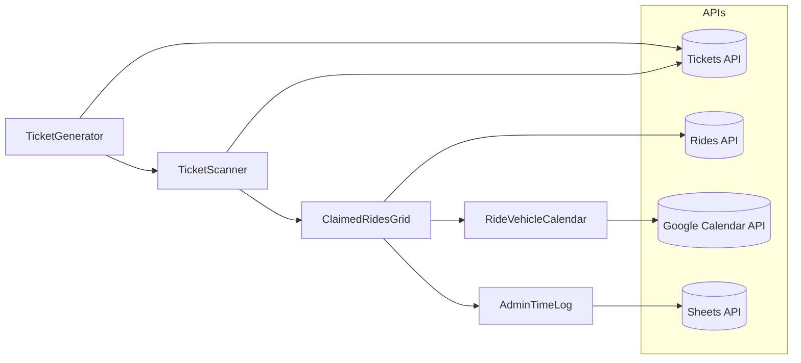

# Ride Claim Portal — Agents Documentation

This document tracks all functional “agents” (modules/components with a defined operational role) used in the Ride Claim portal.
It provides **purpose, inputs, outputs, dependencies, and known caveats** for each agent.

---

## 📑 Table of Contents

1. [Purpose](#-purpose)
2. [Agents List](#-agents-list)

   * [TicketScanner](#1-ticketscanner-agent)
   * [TicketGenerator](#2-ticketgenerator-agent)
   * [RideVehicleCalendar](#3-ridevehiclecalendar-agent)
   * [ClaimedRidesGrid](#4-claimedridesgrid-agent)
   * [AdminTimeLog](#5-admintimelog-agent)
3. [Global Known Issues](#-global-known-issues)
4. [Interaction Flow](#-interaction-flow-mermaid-diagram)

---

## 🎯 Purpose

The portal uses a set of “agents” to automate ride and ticket operations.
Agents act as specialized workers that:

* Generate tickets
* Scan and validate tickets
* Fetch and display ride schedules
* Track driver logs and time records
* Handle ride claims and assignments

---

## 🧠 Agents List

### **1. TicketScanner Agent**

* **Role:**
  Scans QR tickets, validates status (outbound/return), updates scan logs.
* **Inputs:**

  * Ticket ID (parsed from QR)
  * Driver ID (from `localStorage.lrp_driver`)
  * Current date/time
* **Outputs:**

  * Ticket validation status (success/failure)
  * Scan confirmation animation + UI feedback
* **Dependencies:**

  * `/tickets/:id` API (GET)
  * `/tickets/:id/scan` API (POST)
* **Cross-Agent Links:**

  * Updates counts in **ClaimedRidesGrid** after scan confirmation
* **Known Caveats:**

  * Needs confirm button disable after first click (double-click prevention)
  * Modal must auto-close/reset after scan confirmation

---

### **2. TicketGenerator Agent**

* **Role:**
  Generates ride tickets with unique QR codes and stores metadata.
* **Inputs:**

  * Passenger details
  * Pickup/dropoff details
  * Date/time
* **Outputs:**

  * Downloadable QR ticket (image or PDF)
  * Email-ready attachment
* **Dependencies:**

  * QR code generator library
  * Email sending API (for ticket email feature)
* **Cross-Agent Links:**

  * Tickets are later validated by **TicketScanner**
* **Known Caveats:**

  * Bulk generation requires batching to avoid memory spikes

---

### **3. RideVehicleCalendar Agent**

* **Role:**
  Displays vehicle schedules from Google Calendar; highlights ride overlaps.
* **Inputs:**

  * Selected vehicle ID
  * Current week or date range
* **Outputs:**

  * Interactive calendar with event modals
* **Dependencies:**

  * Google Calendar API (`Events.list`)
  * Day.js for timezone formatting
* **Cross-Agent Links:**

  * Referenced by **ClaimedRidesGrid** for ride schedule conflicts
* **Known Caveats:**

  * Event colors are manually mapped
  * API quota limits on frequent refresh

---

### **4. ClaimedRidesGrid Agent**

* **Role:**
  Shows claimed rides in grid form with delete/undo, auto-refresh, and animations.
* **Inputs:**

  * Claimed ride dataset
* **Outputs:**

  * DataGrid table with live updates
* **Dependencies:**

  * `/rides/claimed` API
* **Cross-Agent Links:**

  * Count updates triggered by **TicketScanner** after scans
* **Known Caveats:**

  * Badge count logic must stay in sync with Live/Queue tabs

---

### **5. AdminTimeLog Agent**

* **Role:**
  Displays and manages shuttle time logs in tabbed view.
* **Inputs:**

  * Google Sheets CSV (time logs)
* **Outputs:**

  * Weekly summary per driver
  * Filter/search results
* **Dependencies:**

  * Google Sheets CSV export
* **Cross-Agent Links:**

  * Uses ride IDs also tracked in **ClaimedRidesGrid**
* **Known Caveats:**

  * Time zone differences may affect log accuracy

---

## ⚠ Global Known Issues

* **API Quotas** – Google Calendar + Sheets APIs may throttle on frequent refreshes.
* **QR Scanning Variability** – Mobile device camera permissions and lighting conditions affect scan speed.
* **Latency** – Remote API calls may briefly delay UI updates; retry logic should be in place.
* **Concurrency** – Simultaneous ticket scans (multi-device) may cause race conditions if not locked server-side.

---

## 🔄 Interaction Flow (Mermaid Diagram)

---

